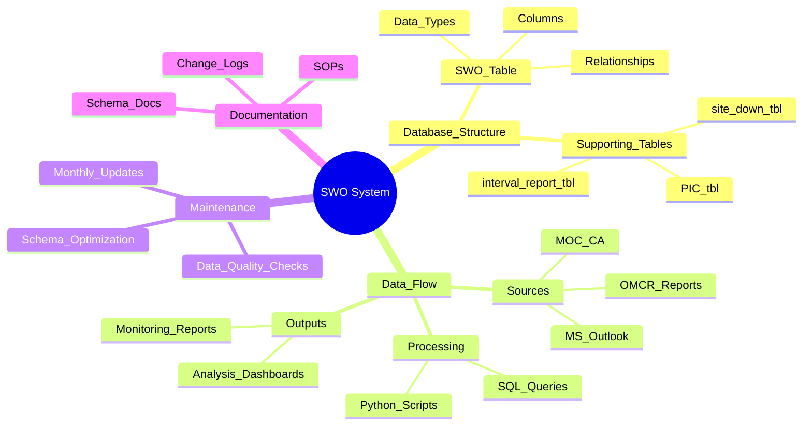
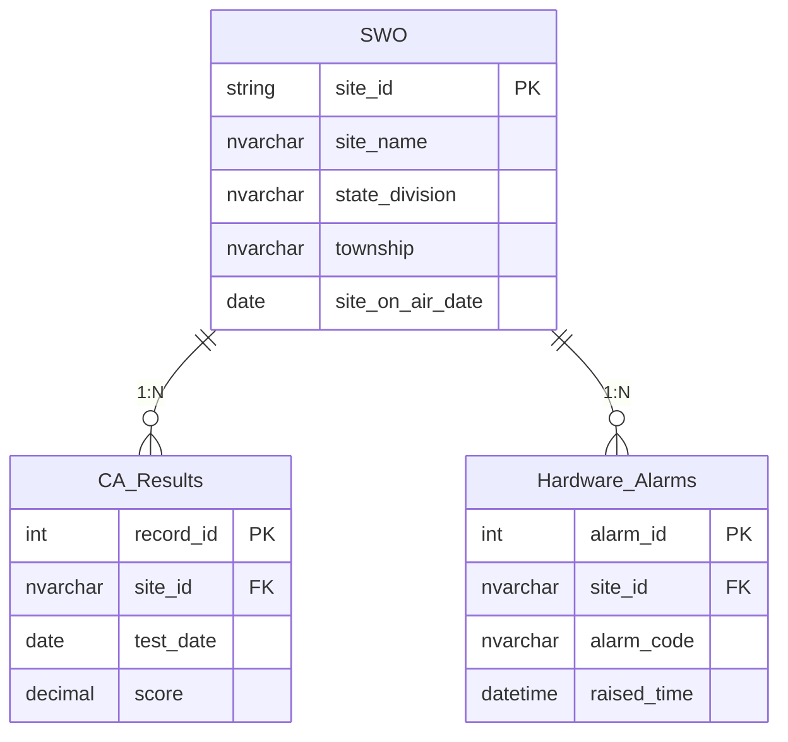
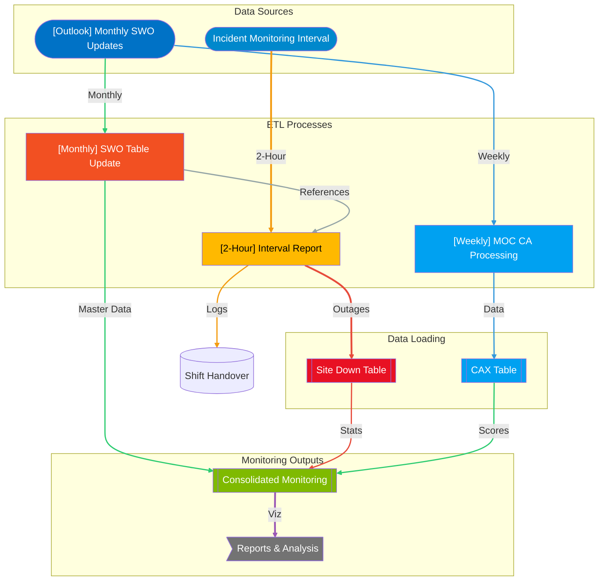
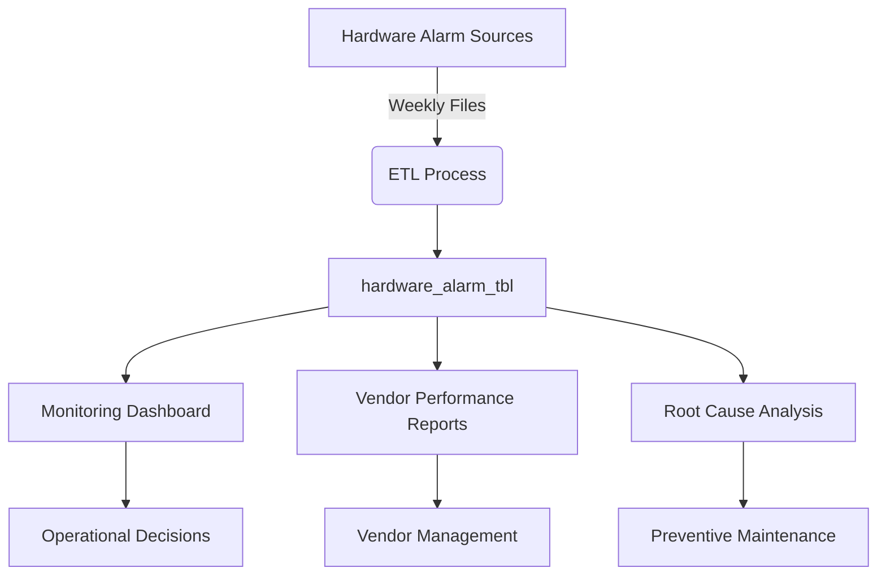
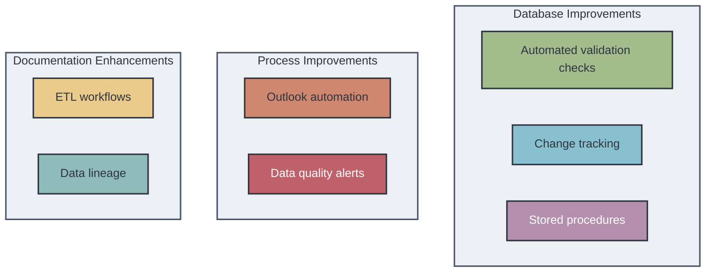
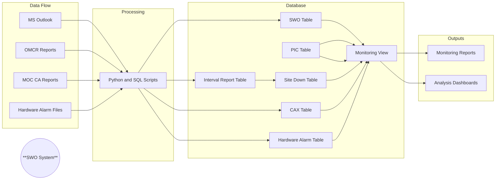

## စနစ်တစ်ခုလုံးခြုံငုံသုံးသပ်ချက်နှင့် မှတ်တမ်းပြုစုခြင်း (System Overview Analysis and Documentation)

## **🌐 ၁။ စနစ်၏ စိတ်ပိုင်းဆိုင်ရာ ပုံစံ (System Mental Model)**



## **လစဉ် SWO အချက်အလက်မွမ်းမံခြင်းအတွက် စံလုပ်ငန်းလည်ပတ်မှု လုပ်ထုံးလုပ်နည်း (SOP for Monthly SWO Update)**

\<div style="background:\#2e3440;color:\#d8dee9;padding:15px;border-radius:10px;border-left:5px solid \#5e81ac"\>
၁။ **အချက်အလက်စုဆောင်းခြင်း (Data Collection)** - MS Outlook Mail မှ မွမ်းမံထားသော အချက်အလက်များကို လက်ခံရယူပါ။
၂။ **အချက်အလက်စိစစ်အတည်ပြုခြင်း (Data Validation)** - ပြည့်စုံမှုနှင့် မှန်ကန်မှုရှိမရှိ စစ်ဆေးပါ။
၃။ **Schema လိုက်နာမှု (Schema Compliance)** - အချက်အလက်များသည် SWO ဇယားဖွဲ့စည်းပုံနှင့် ကိုက်ညီမှုရှိမရှိ သေချာပါစေ။
၄။ **အချက်အလက် ပြောင်းလဲခြင်း (Data Transformation)** - လိုအပ်သလို ပုံစံများ (အထူးသဖြင့် ရက်စွဲများ) ကို ပြောင်းလဲပါ။
၅။ **ဒေတာဘေ့စ် မွမ်းမံခြင်း (Database Update)** - SQL update script များကို လုပ်ဆောင်ပါ။
၆။ **စိစစ်အတည်ပြုခြင်း (Verification)** - မွမ်းမံမှု အောင်မြင်ကြောင်း အတည်ပြုရန် validation query များကို run ပါ။
၇။ **မှတ်တမ်းပြုစုခြင်း (Documentation)** - စနစ် log တွင် မွမ်းမံမှု ပြီးစီးကြောင်း မှတ်တမ်းတင်ပါ။
\</div\>

## **စနစ် ပိုမိုကောင်းမွန်အောင် ဆောင်ရွက်ရန် အကြံပြုချက်များ (System Optimization Recommendations)**

\<div style="background:\#2e3440;color:\#d8dee9;padding:15px;border-radius:10px;border-left:5px solid \#5e81ac"\>

### **ဒေတာဘေ့စ် မြှင့်တင်မှုများ (Database Improvements)**

- အချက်အလက်မွမ်းမံခြင်းမပြုမီ အလိုအလျောက် အချက်အလက်စိစစ်အတည်ပြုခြင်းများ (automated data validation checks) ကို အကောင်အထည်ဖော်ပါ။
- အရေးကြီးသော ဇယားအားလုံးတွင် ပြောင်းလဲမှု မှတ်တမ်းတင်ခြင်း (change tracking) ကို ထည့်သွင်းပါ။
- အဖြစ်များသော မွမ်းမံမှု လုပ်ဆောင်ချက်များအတွက် stored procedure များကို ဖန်တီးပါ။
- ပုံမှန် index ထိန်းသိမ်းမှု လုပ်ငန်းများ (regular index maintenance jobs) ကို သတ်မှတ်ပါ။

### **လုပ်ငန်းစဉ် မြှင့်တင်မှုများ (Process Improvements)**

- Outlook မှ အချက်အလက်စုဆောင်းခြင်းကို ဖြစ်နိုင်သမျှ အလိုအလျောက်လုပ်ဆောင်ပါ။
- အချက်အလက် load မအောင်မြင်ပါက သတိပေးစနစ် (alerting) ကို အကောင်အထည်ဖော်ပါ။
- စံပြုထားသော အချက်အလက်အရည်အသွေး အစီရင်ခံစာများ (standardized data quality reports) ကို ဖန်တီးပါ။
- Schema ပြောင်းလဲမှုများအတွက် စမ်းသပ်ပတ်ဝန်းကျင် (testing environment) ကို ဖန်တီးပါ။

### **မှတ်တမ်းပြုစုမှု မြှင့်တင်မှုများ (Documentation Improvements)**

- ETL workflow အားလုံးကို အသေးစိတ် မှတ်တမ်းတင်ပါ။
- အချက်အလက် မျိုးရိုးဇယား (data lineage diagram) ကို ဖန်တီးပါ။
- နောက်ဆုံးပေါ် schema ပြောင်းလဲမှု log ကို ထိန်းသိမ်းပါ။
- reference table အားလုံးနှင့် ၎င်းတို့၏ ထိန်းသိမ်းမှု လုပ်ထုံးလုပ်နည်းများကို မှတ်တမ်းတင်ပါ။

\</div\>

## **ချက်ချင်း ဇယား ဆက်နွယ်မှုများ (Instant Table Relations)**



## **စီးဆင်းမှုဇယားနှင့် SOP (Flow Chart and SOP)**



## **`pic_tbl` (တာဝန်ခံပုဂ္ဂိုလ်ဇယား) (Person In Charge Table)**

**ရည်ရွယ်ချက် (Purpose)**: ဒေသအလိုက် တာဝန်ခံပုဂ္ဂိုလ်များကို မှတ်တမ်းတင်ရန်။

\<div style="background:\#2e3440;color:\#d8dee9;padding:15px;border-radius:10px;border-left:5px solid \#e61e1eff"\>
**ဖွဲ့စည်းပုံ (Structure)**:

```sql
CREATE TABLE pic_tbl (
State_Division NVARCHAR(100),
Sub_office NVARCHAR(100),
Contact_Person NVARCHAR(100),
Contact_Number NVARCHAR(50)
);
```

**အသုံးပြုပုံ (Usage)**: ပြဿနာများ တိုးမြင့်လာပါက `monitoring_tbl` နှင့် ချိတ်ဆက်ထားသည်။
\</div\>

## **`interval_report_tbl`**

**ရည်ရွယ်ချက် (Purpose)**: ၂ နာရီခြား အင်တာဗယ် ဝန်ဆောင်မှုပြတ်တောက်မှု အစီရင်ခံစာများကို မှတ်တမ်းတင်ရန်။

\<div style="background:\#2e3440;color:\#d8dee9;padding:15px;border-radius:10px;border-left:5px solid \#e61e1eff"\>
**ရင်းမြစ် (Source)**: OMCR team မှ Viber/Telegram မှတစ်ဆင့် ပေးပို့သည်။
**အဓိက Fields များ (Key Fields)**:

- Site status (Revenue, Alarm_Name)
- Timing (Raise_Time, Duration)
- Outage details (Type, Root_Cause)
- Location context (Township, Sub_Office)
  \</div\>

## **`site_down_tbl`**

**ရည်ရွယ်ချက် (Purpose)**: Site ဝန်ဆောင်မှုပြတ်တောက်မှုများ၏ အမြဲတမ်းမှတ်တမ်းကို ထိန်းသိမ်းရန်။

\<div style="background:\#2e3440;color:\#d8dee9;padding:15px;border-radius:10px;border-left:5px solid \#e61e1eff"\>
**အချက်အလက် ဖြည့်သွင်းခြင်း (Population)**:

```sql
TRUNCATE TABLE site_down_tbl;
INSERT INTO site_down_tbl
SELECT * FROM interval_report;
```

**တိုးချဲ့မှုများ (Enhancements)**: `interval_report` မှ column အားလုံးနှင့် SWO-derived field များကို လက်ခံရရှိသည်။
\</div\>

## **`cax` (CA Execution Table)**

**ရည်ရွယ်ချက် (Purpose)**: Call Attempt အောင်မြင်မှုနှုန်းများကို သိမ်းဆည်းရန်။

**ETL လုပ်ငန်းစဉ် (ETL Process)**:

- MOC_CA Excel အစီရင်ခံစာကို လက်ခံရယူပါ။
- Wide format မှ long format သို့ ပြောင်းလဲပါ။
- ရက်စွဲ ပုံစံများကို ရှင်းလင်းပါ။
- Derived field များ (Week, MonthName) ကို တွက်ချက်ပါ။
- SWO အချက်အလက်များဖြင့် ဖြည့်စွက်ပါ။

**အဓိက Metrics များ (Key Metrics)**:

- CA_Result: Decimal percentage
- CA_Range: Binned performance categories

## **`hardware_alarm_tbl`**

**ရည်ရွယ်ချက် (Purpose)**: စက်ပစ္စည်းချို့ယွင်းမှုဖြစ်စဉ်များကို မှတ်တမ်းတင်ရန်။

**အဓိက အတိုင်းအတာများ (Key Dimensions)**:

- စက်ပစ္စည်းအမျိုးအစား (Board_Type)
- အခြေအနေအချိန်ဇယား (Raised_Time → Target_Plan_Date)
- ဖြေရှင်းမှုမှတ်တမ်း (LSP_Remark, Action_Plan)

### **Hardware Alarm Workflow ခြုံငုံသုံးသပ်ချက် (Hardware Alarm Workflow Overview)**

**အချက်အလက်စုဆောင်းခြင်း (Data Collection)**

- **ရင်းမြစ် (Source)**: Internal system sharing (ပုံမှန်အားဖြင့် CSV/Excel ဖိုင်များ)
- **အကြိမ်ရေ (Frequency)**: အပတ်စဉ် (လွန်ခဲ့သည့်အပတ်၏ အချက်အလက်များအတွက် တနင်္လာနေ့တိုင်း)
- **ဖိုင်အမည်ပေးခြင်း စည်းမျဉ်း (File Naming Convention)**: `HW_Alarms_YYYY_MM_DD_to_YYYY_MM_DD.xlsx`

**ဇယားဖွဲ့စည်းပုံ (`hardware_alarm_tbl`) (Table Structure)**

```sql
CREATE TABLE hardware_alarm_tbl (
Site_ID NVARCHAR(50) NOT NULL,
Render NVARCHAR(100),
Region NVARCHAR(100),
On_air_status NVARCHAR(50),
Township NVARCHAR(100),
LSP NVARCHAR(100),
Alarm_Code NVARCHAR(50),
Raised_Time DATETIME2,
Board_Type NVARCHAR(100),
Status NVARCHAR(50),
Descriptions NVARCHAR(500),
Week NVARCHAR(10),
Category NVARCHAR(100),
Sub_Category NVARCHAR(100),
Issue_status NVARCHAR(50),
LSP_Remark NVARCHAR(500),
Root_Cause NVARCHAR(500),
Action_Plan_Progress NVARCHAR(500),
Target_Plan_Date DATE,
Load_Date DATETIME2 DEFAULT GETDATE(),

CONSTRAINT PK_HardwareAlarms PRIMARY KEY (Site_ID, Alarm_Code, Raised_Time)
);
```

## **အပတ်စဉ် ETL လုပ်ငန်းစဉ် (Weekly ETL Process)**

**A. အချက်အလက်ထုတ်ယူခြင်း (Data Extraction)**

```python
def get_hardware_alarms(week_start_date): # Calculate week range
week_end_date = week_start_date + timedelta(days=6)
# Connect to source system:

source_path = f"//network/share/hw_alarms/HW_Alarms_{week_start_date:%Y_%m_%d}_to_{week_end_date:%Y_%m_%d}.xlsx"

try:
    df = pd.read_excel(
        source_path,
        sheet_name='Active Alarms',
        parse_dates=['Raised_Time', 'Target_Plan_Date']
    )
    df['Week'] = f"Week {week_start_date.isocalendar()[1]}"
    return df
except Exception as e:
    log_error(f"Hardware alarm extraction failed: {str(e)}")
    raise
```

**B. အချက်အလက် ပြောင်းလဲခြင်း (Data Transformation)**

```python
def transform_hardware_alarms(raw_df): # Standardize fields
transformations = {
'Site ID': ('Site_ID', lambda x: x.upper().strip()),
'Alarm Description': ('Descriptions', str),
'Planned Resolution Date': ('Target_Plan_Date', pd.to_datetime)
}
    for old, (new, func) in transformations.items():
        raw_df[new] = raw_df[old].apply(func)

    # Categorize alarms
    category_mapping = {
        'BBU': 'Baseband',
        'RRU': 'Radio',
        'Power': 'Infrastructure'
    }

    raw_df['Category'] = raw_df['Board_Type'].map(category_mapping).fillna('Other')

    # Add derived fields
    raw_df['Sub_Category'] = raw_df['Descriptions'].apply(
        lambda x: x.split(':')[0] if ':' in x else 'General'
    )

    return raw_df[hardware_alarm_columns]  # Defined list of target columns
```

**C. ဒေတာဘေ့စ်သို့ ထည့်သွင်းခြင်း (Database Load)**

```sql
-- Weekly Load Procedure
CREATE PROCEDURE sp_load_hardware_alarms
@week_start_date DATE
AS
BEGIN
SET NOCOUNT ON;
BEGIN TRANSACTION;

-- Clear existing data for the week
DELETE FROM hardware_alarm_tbl
WHERE Raised_Time BETWEEN @week_start_date AND DATEADD(day, 6, @week_start_date);

-- Insert new records
INSERT INTO hardware_alarm_tbl (
    Site_ID, Render, Region, On_air_status, Township, LSP,
    Alarm_Code, Raised_Time, Board_Type, Status, Descriptions,
    Week, Category, Sub_Category, Issue_status, LSP_Remark,
    Root_Cause, Action_Plan_Progress, Target_Plan_Date
)
SELECT
    Site_ID, Render, Region, On_air_status, Township, LSP,
    Alarm_Code, Raised_Time, Board_Type, Status, Descriptions,
    Week, Category, Sub_Category, Issue_status, LSP_Remark,
    Root_Cause, Action_Plan_Progress, Target_Plan_Date
FROM #temp_hardware_alarms;

-- Update monitoring table references
EXEC sp_refresh_hardware_alarm_references;

COMMIT TRANSACTION;
END
```

## **အပတ်စဉ် အစီရင်ခံခြင်း (Weekly Reporting)**

**A. Aging Analysis Report**

```sql
SELECT
Board_Type,
Issue_status,
DATEDIFF(day, Raised_Time, GETDATE()) as days_open,
COUNT(*) as alarm_count
FROM hardware_alarm_tbl
WHERE
Status NOT IN ('Closed', 'Resolved')
AND Raised_Time >= DATEADD(week, -4, GETDATE())
GROUP BY
Board_Type,
Issue_status,
DATEDIFF(day, Raised_Time, GETDATE())
ORDER BY
days_open DESC;
```

**B. Resolution Performance**

```python
def generate_hardware_weekly_report():
conn = get_db_connection()

    # Resolution metrics
    resolution_df = pd.read_sql("""
        SELECT
            LSP,
            COUNT(*) as total_alarms,
            AVG(DATEDIFF(hour, Raised_Time,
                CASE WHEN Status = 'Closed' THEN GETDATE() ELSE NULL END)) as avg_resolution_hours,
            SUM(CASE WHEN Status = 'Closed' THEN 1 ELSE 0 END) as closed_count
        FROM hardware_alarm_tbl
        WHERE Week = DATEPART(week, GETDATE()) - 1
        GROUP BY LSP
    """, conn)

    # Trend analysis
    trend_df = pd.read_sql("""
        SELECT
            Board_Type,
            Category,
            DATEPART(week, Raised_Time) as week_number,
            COUNT(*) as alarm_count
        FROM hardware_alarm_tbl
        WHERE Raised_Time >= DATEADD(week, -8, GETDATE())
        GROUP BY Board_Type, Category, DATEPART(week, Raised_Time)
    """, conn)

    # Create Excel report
    with pd.ExcelWriter(f"HW_Alarms_Report_{datetime.now():%Y%m%d}.xlsx") as writer:
        resolution_df.to_excel(writer, sheet_name='Resolution Metrics')
        trend_df.to_excel(writer, sheet_name='Trend Analysis')

        # Add pivot table
        pivot = trend_df.pivot_table(
            index=['Board_Type', 'Category'],
            columns='week_number',
            values='alarm_count',
            aggfunc='sum'
        )
        pivot.to_excel(writer, sheet_name='Pivot View')
```

## **အခြားစနစ်များနှင့် ပေါင်းစပ်မှု (Integration with Other Systems)**



**အဓိက ထိန်းသိမ်းမှု လုပ်ငန်းများ (Key Maintenance Tasks)**
**အပတ်စဉ် စစ်ဆေးရန်စာရင်း (Weekly Checklist)**:
**Data မတင်မီ စိစစ်အတည်ပြုခြင်း (Pre-Load Validation)**

- ဖိုင်ပြည့်စုံမှု ရှိမရှိ စစ်ဆေးခြင်း (မျှော်မှန်းထားသော site များ၊ ရက်စွဲအပိုင်းအခြား)
- ထပ်နေသော alarm entry များရှိမရှိ စစ်ဆေးခြင်း
- အရေးကြီးသော field format များ (Site_ID, Raised_Time) ကို စိစစ်အတည်ပြုခြင်း

**Data တင်ပြီးနောက် စိစစ်အတည်ပြုခြင်း (Post-Load Verification)**

```sql
-- Count comparison
DECLARE @source_count INT = (SELECT COUNT(*) FROM #temp_hardware_alarms);
DECLARE @loaded_count INT = (SELECT COUNT(*) FROM hardware_alarm_tbl
WHERE Load_Date > GETDATE()-1);

IF @source_count != @loaded_count
RAISERROR('Count mismatch between source and loaded data', 16, 1);
```

**အချက်အလက် အရည်အသွေး စောင့်ကြည့်ခြင်း (Data Quality Monitoring)**

```sql
-- Missing resolution plans
SELECT COUNT(*)
FROM hardware_alarm_tbl
WHERE
Status NOT IN ('Closed', 'Resolved')
AND (Action_Plan_Progress IS NULL OR Target_Plan_Date IS NULL);
```

**ပြဿနာဖြေရှင်းနည်း လမ်းညွှန် (Troubleshooting Guide)**

\<div style="background:\#2e3440;color:\#d8dee9;padding:15px;border-radius:10px;border-left:5px solid \#e61e1eff"\>
**ပြဿနာ (Symptom)** | **ဖြစ်နိုင်သောအကြောင်းရင်း (Possible Cause)** | **ဖြေရှင်းချက် (Resolution)**
\---|---|---
Missing alarm records | Incorrect date filter in source file | Verify source file covers full week
Duplicate entries | Same alarm code for same site at same time | Add constraint to prevent duplicates
Long load times | Unindexed date fields | Create index on Raised_Time
Board_Type misclassification | New hardware types not in mapping table | Update category mapping table
\</div\>
ဤအပတ်စဉ် hardware alarm စီမံဆောင်ရွက်မှုစနစ်သည် စက်ပစ္စည်းပြဿနာများကို ကျယ်ကျယ်ပြန့်ပြန့် မှတ်တမ်းတင်နိုင်ပြီး ပိုမိုကျယ်ပြန့်သော network စောင့်ကြည့်မှု framework များနှင့် ပေါင်းစပ်ကာ လုပ်ဆောင်ပေးသည်။ ဖွဲ့စည်းထားသော ချဉ်းကပ်မှုသည် တသမတ်တည်း အစီရင်ခံခြင်းနှင့် ခေတ်ရေစီးကြောင်းဆန်းစစ်ခြင်းတို့ကို ပြုလုပ်နိုင်သဖြင့် ထိန်းသိမ်းမှုစီမံကိန်းများကို ပိုမိုကောင်းမွန်စေသည်။

## **`monitoring_tbl`**

**ရည်ရွယ်ချက် (Purpose)**: စုစည်းထားသော လုပ်ငန်းဆောင်တာ dashboard။

**အချက်အလက် ပေါင်းစပ်မှု (Data Integration)**:

```sql
CREATE VIEW monitoring_tbl AS
SELECT
s.*,
sd.Raise_Time, sd.Outage_Type, sd.Root_Cause,
c.CA_Result, c.CA_Range,
CASE...END AS Time_Bucket,
CASE...END AS Issue_Identity
FROM swo s
LEFT JOIN site_down_tbl sd ON s.Site_ID = sd.Site_ID
LEFT JOIN cax c ON s.Site_ID = c.Site_ID;
```

## **`sh_handover_tbl`**

**ရည်ရွယ်ချက် (Purpose)**: Site လွှဲပြောင်းမှုဖြစ်စဉ်များကို မှတ်တမ်းတင်ရန်။

\<div style="background:\#2e3440;color:\#d8dee9;padding:15px;border-radius:10px;border-left:5px solid \#e61e1eff"\>
**အဓိက လုပ်ငန်းစဉ် (Key Process)**:

- RFO (Reason For Outage) များကို စံပြုရန် fuzzy matching ကို အသုံးပြုပါ။
- ကြာချိန် metric များကို တွက်ချက်ပါ။
- နှောင့်နှေးရသည့် အကြောင်းရင်းများကို အမျိုးအစားခွဲပါ။
  \</div\>

## **`std_rfo_tbl`**

**ရည်ရွယ်ချက် (Purpose)**: ဝန်ဆောင်မှုပြတ်တောက်ရသည့် အကြောင်းရင်း (Reason For Outage) ၏ စံပြုထားသော catalog။

\<div style="background:\#2e3440;color:\#d8dee9;padding:15px;border-radius:10px;border-left:5px solid \#e61e1eff"\>
**ဖွဲ့စည်းပုံ (Structure)**:

```
Code Root_Caused Priority
00001 BTS, CPRI Critical
... ... ...
```

\</div\>

## **`hubnet_tbl`**

**ရည်ရွယ်ချက် (Purpose)**: ကွန်ရက်လမ်းကြောင်း Mapping။

**ဆက်နွယ်မှု မှတ်တမ်းတင်ခြင်း (Relationship Tracking)**:

- REF_Site → Pathing_1 → Route_to_Route_Tsp_1
- ချိတ်ဆက်မှု အခြေအနေ ညွှန်ပြချက်များ

## **အသေးစိတ် လုပ်ငန်းအဆင့်များ (Detailed Workflows)**

**A. လစဉ် SWO အချက်အလက်မွမ်းမံခြင်း လုပ်ငန်းစဉ် (Monthly SWO Update Process)**

\<div style="background:\#2e3440;color:\#d8dee9;padding:15px;border-radius:10px;border-left:5px solid \#e61e1eff"\>
**အချက်အလက် ထုတ်ယူခြင်း (Data Extraction)**

- Outlook shared folder: `\\outlook\shared\swo_updates\` ကို ရှာဖွေပါ။
- `YYYY_MM_SWO_Update.xlsx` ကို download လုပ်ပါ။

**စံလုပ်ငန်းလည်ပတ်မှု လုပ်ထုံးလုပ်နည်း (SOP) အတွက် လစဉ် SWO မွမ်းမံခြင်း (Standard Operating Procedure (SOP) for Monthly SWO Update)**



## **အချက်အလက်ပြင်ဆင်ခြင်း (Data Preparation)**:

```python
def clean_swo_data(df): # Standardize Site_ID format
df['Site_ID'] = df['Site_ID'].str.upper().str.strip()

# Convert coordinate fields
df['Candidate_Latitude'] = pd.to_numeric(df['Candidate_Latitude'])
df['Candidate_Longitude'] = pd.to_numeric(df['Candidate_Longitude'])

# Validate date fields
date_cols = ['Site_On_Air_MS_11_8', 'TPAC_Date_MS_11_9_2']
df[date_cols] = df[date_cols].apply(pd.to_datetime, errors='coerce')

return df
```

## **ဒေတာဘေ့စ် မွမ်းမံခြင်း (Database Update)**:

```sql
BEGIN TRANSACTION;

-- Backup existing data
SELECT * INTO swo_backup_YYYYMM FROM swo;

-- Clear and reload
TRUNCATE TABLE swo;

BULK INSERT swo
FROM 'D:\processed_data\swo_update.csv'
WITH (
FIELDTERMINATOR = ',',
ROWTERMINATOR = '\n',
FIRSTROW = 2
);

-- Validate counts
DECLARE @expected INT = (SELECT COUNT(*) FROM swo_backup_YYYYMM);
DECLARE @actual INT = (SELECT COUNT(*) FROM swo);

IF @expected = @actual
COMMIT TRANSACTION;
ELSE
ROLLBACK TRANSACTION;
RAISERROR('Count mismatch detected', 16, 1);
```

**B. Interval Report စီမံဆောင်ရွက်ခြင်း (Interval Report Processing)**

- **ဖိုင် ရယူခြင်း (File Acquisition)**:
  - Telegram channel တွင် report အသစ်များအတွက် စောင့်ကြည့်ပါ။
  - Timestamp ဖြင့် download လုပ်ပါ: `INT_REPORT_YYYYMMDD_HHMM.csv`

## **အချက်အလက် မြှင့်တင်ခြင်း (Data Enhancement)**:

```python
def enhance_interval_report(df): # Apply fuzzy RFO matching
detector = RFODetector()
df[['RFO_Code', 'Refinated_RFO']] = df['Root_Cause'].apply(
lambda x: pd.Series(detector.detect_rfo_expression(x))
)

# Calculate duration
df['Duration'] = df['Current_Time'] - df['Raise_Time']

# Categorize outage
df['Outage_Range'] = pd.cut(
    df['Duration'].dt.total_seconds()/3600,
    bins=[0, 4, 12, 24, 48, float('inf')],
    labels=['0-4h', '4-12h', '12-24h', '1-2d', '2d+']
)

return df
```

## **ဒေတာဘေ့စ် ပေါင်းစပ်မှု (Database Integration)**:

```sql
-- Update site_down_tbl
EXEC sp_refresh_site_downtime;

-- Refresh monitoring view
EXEC sp_refresh_monitoring_view;
```

## **MOC CA Report စီမံဆောင်ရွက်ခြင်း (MOC CA Report Processing)**

### **အချက်အလက် ပြောင်းလဲခြင်း (Data Transformation)**:

```python
def process_moc_ca(file_path):
df = pd.read_excel(file_path)

# Standardize column names
df = df.rename(columns={'Site ID': 'Site_ID'})

# Melt wide format to long
melted = pd.melt(
    df,
    id_vars=['Site_ID'],
    var_name='Date',
    value_name='CA_Result'
)

# Clean dates
melted['Date'] = pd.to_datetime(melted['Date'], errors='coerce')
melted['Week'] = melted['Date'].dt.strftime('W%U')

return melted
```

### **ဒေတာဘေ့စ် ထည့်သွင်းခြင်း (Database Load)**:

```sql
-- CAX table update procedure
CREATE PROCEDURE sp_update_cax
AS
BEGIN
-- Clear existing data for date range
DELETE FROM cax
WHERE Date BETWEEN @start_date AND @end_date;

-- Insert new records
INSERT INTO cax (
    Site_ID, Date, CA_Result,
    Sub_Office, Region, Township
)
SELECT
    t.Site_ID, t.Date, t.CA_Result,
    s.Sub_Office, s.State_Division, s.Township
FROM #temp_cax t
JOIN swo s ON t.Site_ID = s.Site_ID;

-- Update derived fields
EXEC sp_calculate_cax_derived_fields;

END
```

## **🧩အချက်အလက် ပုံစံနှင့် ERD (Data Model & ERD)**



## **အဓိက ထိန်းသိမ်းမှု Script များ (Key Maintenance Scripts)**

### **၁။ အချက်အလက် အရည်အသွေး စစ်ဆေးခြင်း (Data Quality Check)**

```sql
CREATE PROCEDURE sp_swo_data_quality_check
AS
BEGIN
-- Check for missing Site_IDs
IF EXISTS (SELECT 1 FROM swo WHERE Site_ID IS NULL)
RAISERROR('Null Site_ID detected', 16, 1);
-- Validate coordinate ranges
DECLARE @bad_coords INT = (
    SELECT COUNT(*) FROM swo
    WHERE Candidate_Latitude NOT BETWEEN -90 AND 90
       OR Candidate_Longitude NOT BETWEEN -180 AND 180
);

    IF @bad_coords > 0
    RAISERROR('Invalid coordinates detected', 16, 1);

-- Check date consistency
IF EXISTS (
    SELECT 1 FROM swo
    WHERE Site_Hand_Over_Date_MS_11_10_1 < TPAC_Date_MS_11_9_2
)
    RAISERROR('Illogical date sequence found', 16, 1);
END
```

### **၂။ စွမ်းဆောင်ရည် မြှင့်တင်ခြင်း (Performance Optimization)**

```sql
-- Recommended indexes
CREATE INDEX idx_swo_location ON swo(State_Division, Township);
CREATE INDEX idx_swo_tech ON swo(Technology, Transmission_Type);
CREATE INDEX idx_cax_date ON cax(Date);
CREATE INDEX idx_site_down_time ON site_down_tbl(Raise_Time);
```

**၃။ အလိုအလျောက် အစီရင်ခံခြင်း (Automated Reporting)**

```python
def generate_daily_ops_report(): # Connect to DB
conn = pyodbc.connect(CONN_STRING)
    # Site status summary
    status_query = """
    SELECT
        m.State_Division,
        COUNT(CASE WHEN m.CA_RANGE = '0-50 RANGE' THEN 1 END) as poor_perf_sites,
        COUNT(CASE WHEN sd.Site_ID IS NOT NULL THEN 1 END) as outage_sites,
        COUNT(*) as total_sites
    FROM monitoring_tbl m
    LEFT JOIN site_down_tbl sd ON m.Site_ID = sd.Site_ID
    GROUP BY m.State_Division
    """

    # Hardware alarm analysis
    hardware_query = """
    SELECT
        Board_Type,
        Issue_status,
        COUNT(*) as alarm_count
    FROM hardware_alarm_tbl
    WHERE Raised_Time > DATEADD(day, -7, GETDATE())
    GROUP BY Board_Type, Issue_status
    """

    # Generate Excel report
    with pd.ExcelWriter('daily_ops_report.xlsx') as writer:
        pd.read_sql(status_query, conn).to_excel(writer, sheet_name='Site Status')
        pd.read_sql(hardware_query, conn).to_excel(writer, sheet_name='Hardware Alarms')

    # Email distribution
    send_email(
        recipients=['ops-team@company.com'],
        subject='Daily Operations Report',
        body='Attached is the daily operations summary',
        attachments=['daily_ops_report.xlsx']
    )
```

## **ပြဿနာဖြေရှင်းနည်း လမ်းညွှန် (Troubleshooting Guide)**

### **ပြဿနာ (Issue)** | **ဖြေရှင်းရန်အဆင့်များ (Resolution Steps)**

**Missing SWO Info updates**

    ၁။ Outlook shared folder ခွင့်ပြုချက်များ စစ်ဆေးပါ။
    ၂။ အီးမေးလ် filter များ စစ်ဆေးပါ။
    ၃။ ဒေသဆိုင်ရာ ညှိနှိုင်းရေးမှူးများနှင့် ဆက်သွယ်ပါ။

**Interval report delays**

    ၁။ Telegram တွင် OMCR အဖွဲ့ကို ping လုပ်ပါ။
    ၂။ အလိုအလျောက် download script များကို စစ်ဆေးပါ။
    ၃။ ဖိုင်အမည်ပေးခြင်း စည်းမျဉ်းများကို စစ်ဆေးပါ။

**CAX data mismatch**

    ၁။ Source ရှိ ရက်စွဲ format များကို စိစစ်အတည်ပြုပါ။
    ၂။ Melting procedure ကို စစ်ဆေးပါ။
    ၃။ SWO နှင့် join condition များကို စစ်ဆေးပါ။

**Performance issues**

    ၁။ Index များကို ပြန်လည်တည်ဆောက်ပါ။
    ၂။ Query plan များကို စစ်ဆေးပါ။
    ၃။ အချက်အလက်ဟောင်းများကို archive လုပ်ပါ။

ဤပြည့်စုံသော မှတ်တမ်းသည် စနစ်ရှိ ဇယားများ၊ ၎င်းတို့၏ ဆက်နွယ်မှုများ၊ လုပ်ငန်းစဉ် အဆင့်ဆင့်နှင့် ထိန်းသိမ်းမှု လုပ်ထုံးလုပ်နည်းများ အားလုံးကို အကျုံးဝင်သည်။ အကောင်အထည်ဖော်မှုသည် အချက်အလက် ပြည့်စုံမှု၊ စွမ်းဆောင်ရည်နှင့် လုပ်ငန်းဆောင်တာများ၏ မြင်သာထင်သာရှိမှုတို့အတွက် အကောင်းဆုံး လုပ်ဆောင်မှုများကို လိုက်နာထားသည်။
